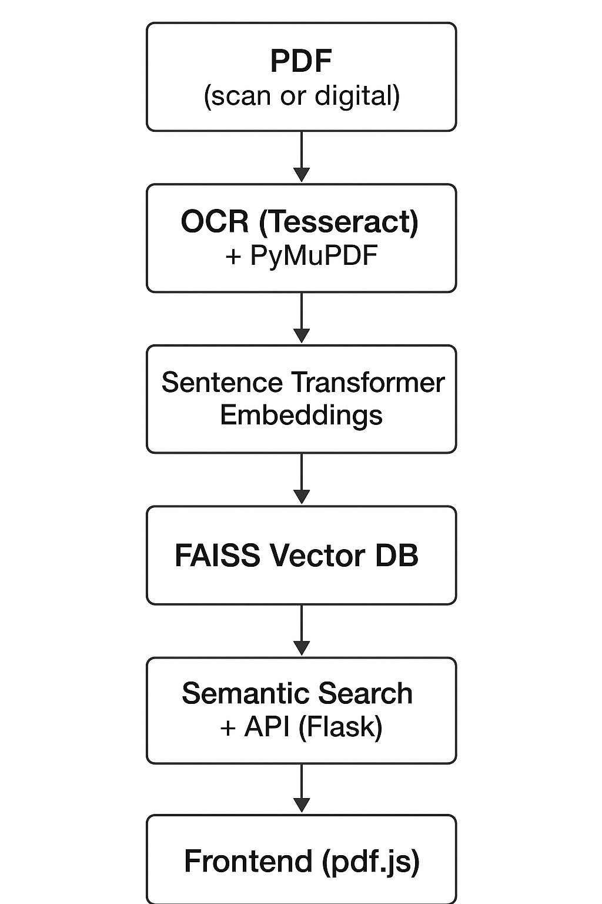
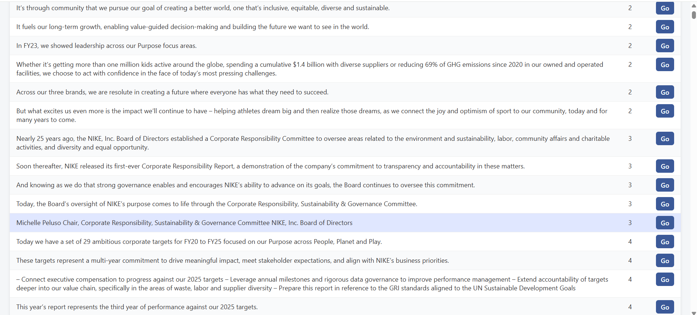

# Document Intelligence Pipeline

AI-powered PDF parsing & semantic search for scanned and digital documents.

---

## 📖 Overview

The **Document Intelligence Pipeline** is an end-to-end system that extracts, processes, and searches text from both scanned and digital PDFs. It combines OCR, embeddings, and semantic search to help users find relevant information quickly — useful for ESG reports, invoices, contracts, research papers, and more.

---

## 🚀 Features

* Parse **digital and scanned PDFs** (with OCR)
* Extract text with **PyMuPDF** and **Tesseract OCR**
* Generate **Sentence Transformer embeddings**
* Store and query embeddings using **FAISS vector database**
* Perform **semantic search** (not just keyword matching)
* Highlight results in **frontend with pdf.js**

---

## 🛠️ Tech Stack

* **Python** (Flask backend)
* **PyMuPDF** (text extraction)
* **Tesseract OCR** (for scanned PDFs)
* **Sentence Transformers** (embedding generation)
* **FAISS** (vector similarity search)
* **pdf.js** (frontend rendering and highlights)

---

## 🔎 Architecture

### Flow:

```
PDF → OCR (Tesseract/PyMuPDF) → Sentence Transformer Embeddings →
FAISS Vector DB → Semantic Search (Flask API) → Frontend (pdf.js)
```

### Diagram:



---

## 📸 Screenshots

**App UI:**


**Search Demo:**


---

## 🎯 Use Cases

* **ESG Reports** → highlight and extract sustainability insights
* **Invoices** → detect and retrieve financial details
* **Contracts** → find clauses and obligations quickly
* **Research Papers** → locate references and keywords efficiently

---

## ⚙️ Installation

```bash
git clone https://github.com/KILLER-ALLLEY/Document-Intelligence-Pipeline-AI-Powered-PDF-Parsing-Semantic-Search.git
cd Document-Intelligence-Pipeline-AI-Powered-PDF-Parsing-Semantic-Search
pip install -r requirements.txt
python app.py
```

---

## 🔮 Future Improvements

* Multi-document semantic search
* Fine-tuned embeddings for domain-specific tasks
* Export results to CSV/JSON
* Web-based interactive dashboard

---

## 📜 License

MIT License
